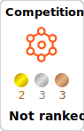

# Hello World!
👋 I'm shu421, learning Machine/Deep Learning on Kaggle.

  

Profile: [Linktree](https://linktr.ee/shu421)

<h3 align="left">Languages and Tools:</h3>

  
  
    </a>
   
  <a href="https://www.gnu.org/software/bash/" target="_blank" rel="noreferrer"> 
  

